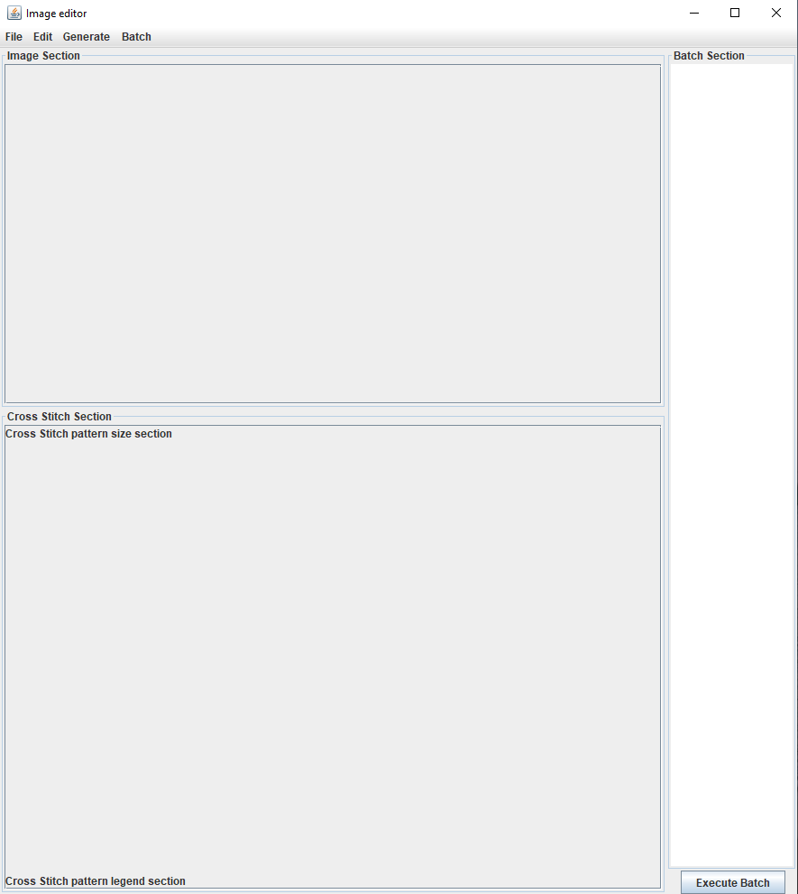
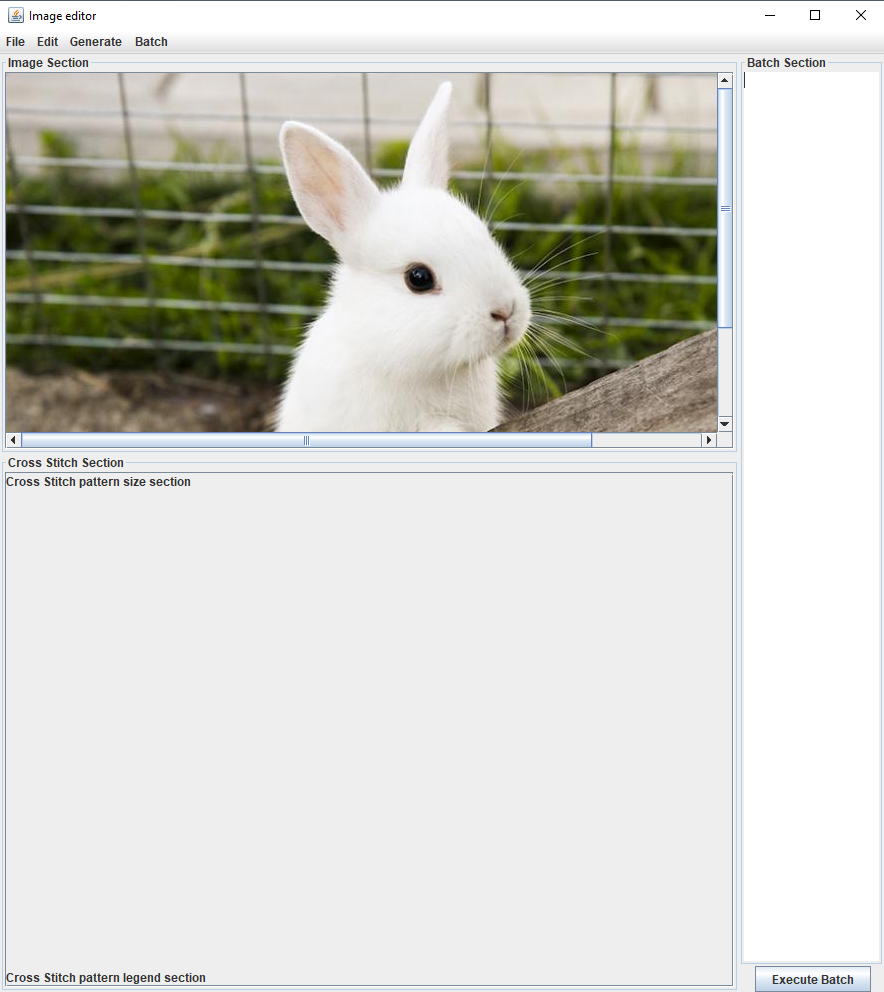
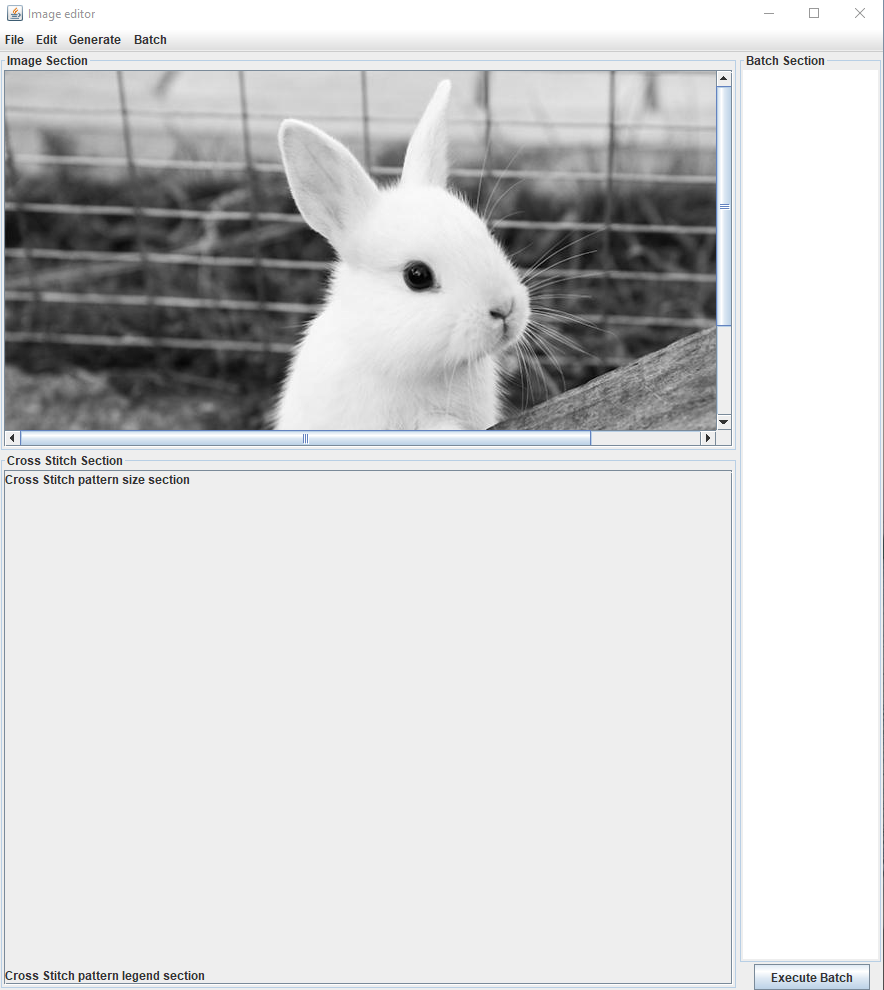
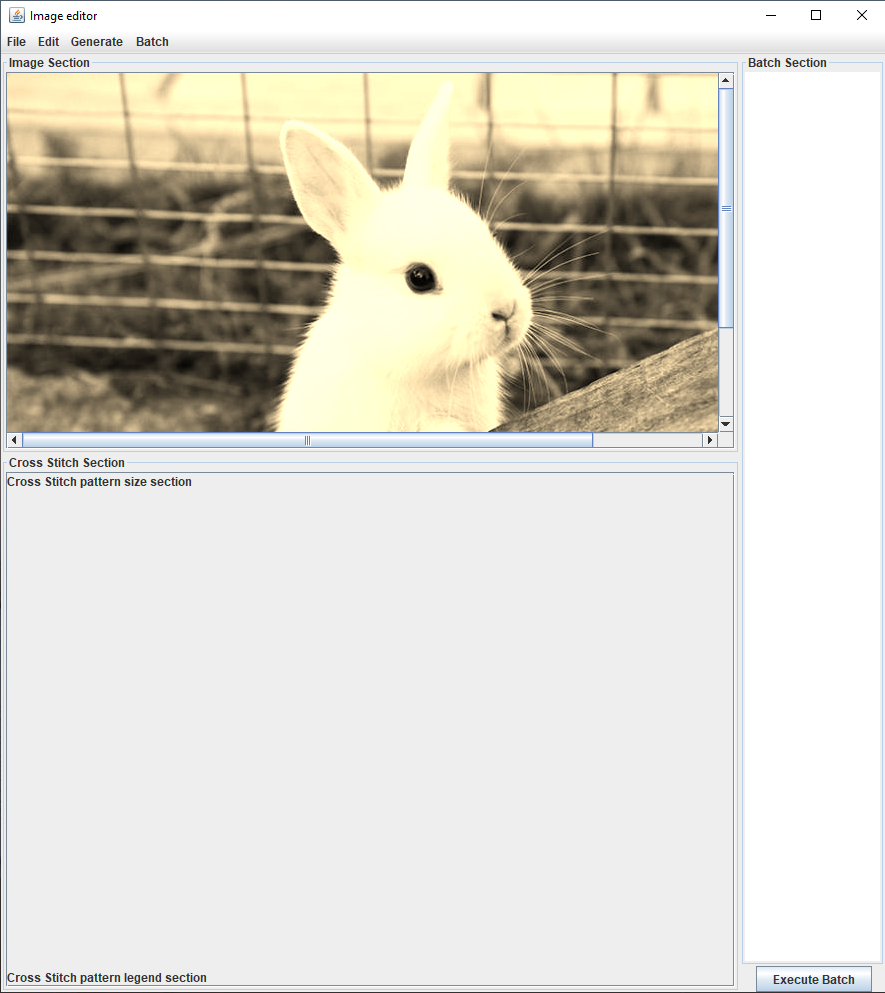
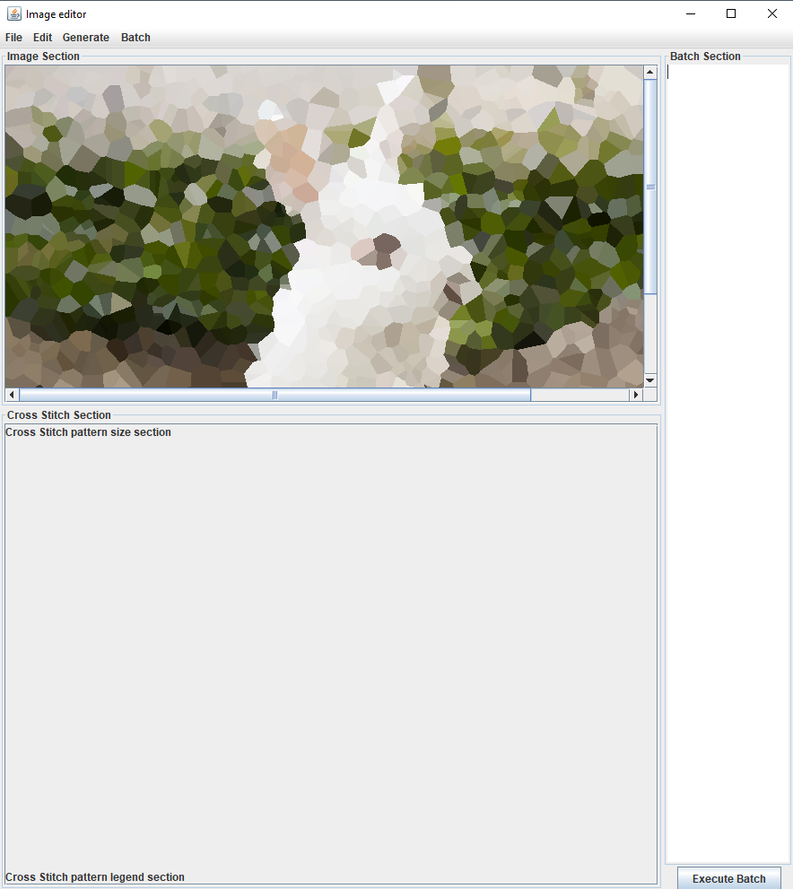
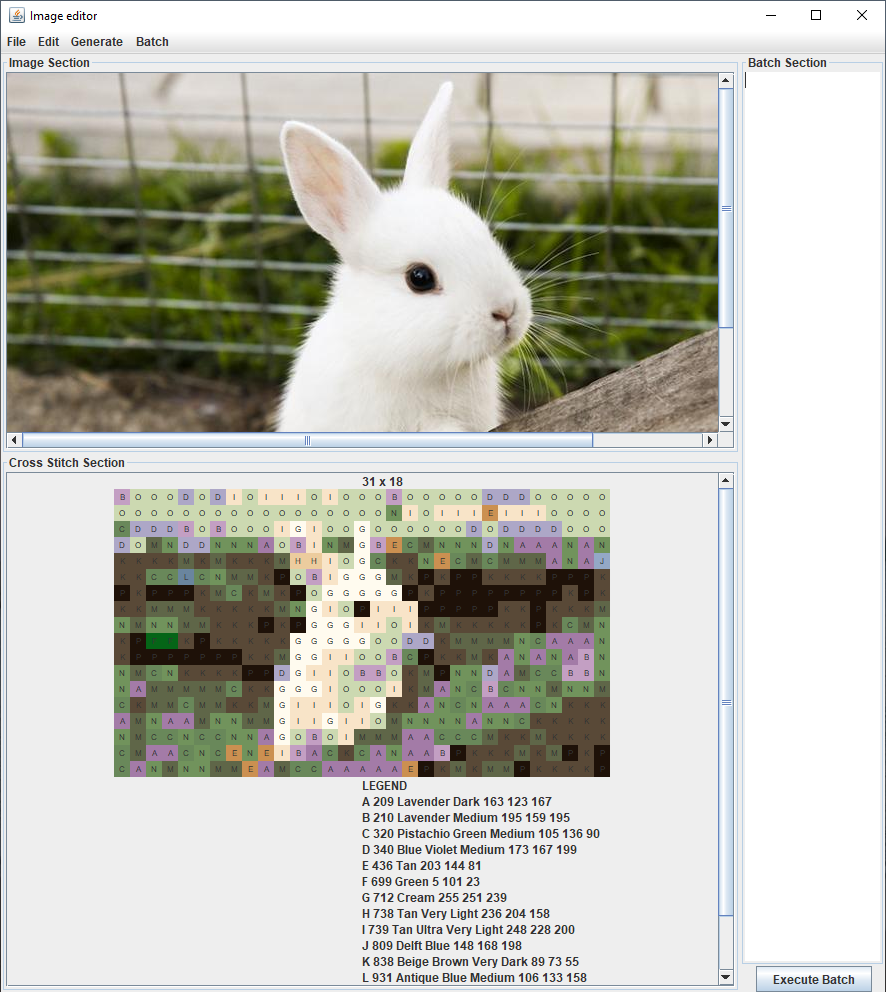
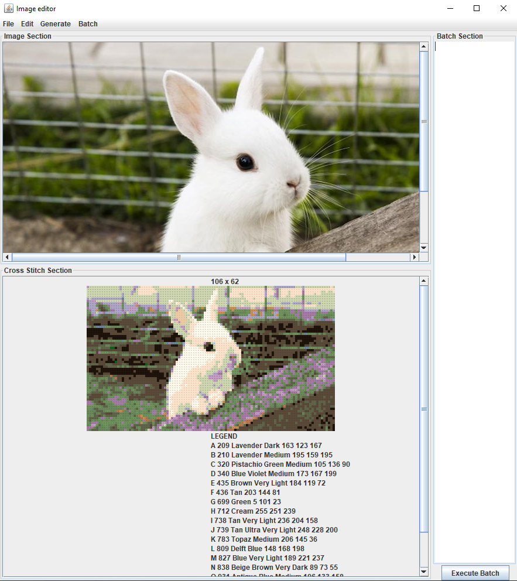
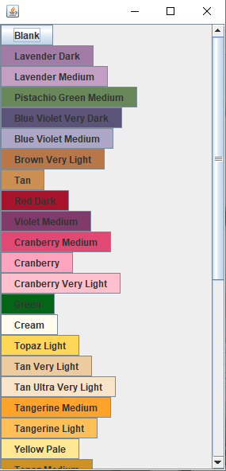
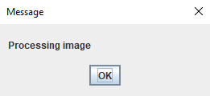

# About

This program is an image editor that provides various effects and can generate a cross stitch pattern.

# List of Features

#### file related
- load filename
- save filename

#### Filter related
- blur
- sharpen

#### Transformation related
- grey
- sepia
        
#### Reduction related
- reduce n
- dither n

#### Mosaic related
- mosaic n
- pixelate n

#### Cross Stitch related
- pattern n
- export filename.txt

#### Exit related
- q
- quit

#### Things to know
- n = number parameter
- filename is an example parameter for the load and save
- filename.txt is an example parameter for the txt file to save
        
# How to Run

Use the Project5SunWuchoi.jar file in res folder.

If this does not work, in CMD or shell, go to the res directory
and type  "java -jar Project5SunWuChoi.jar -interactive" or the equivalent command for your OS to run the program

If this does not work, import the zip file to your java IDE and run the driver class.
    
# How to Use the Program

#### Interactive mode

Entering "-interactive" will enter interactive mode with GUI.
            
#### Batch script mode

Entering "-script input.txt" will enter script mode.

In script mode, the program will run the commands in the batch file.

Example: "java -jar Project5SunWuChoi.jar -script input.txt"

input.txt must be in the same directory as the Project5SunWuChoi.jar

Caution: CMD or shell commands may differ for different operating systems.
       

# Description of Example Runs

1. Opened the program in interactive mode

2. Loaded rabbit.png by File -> Open -> rabbit.png

3. Applied grey scale by Edit -> Grey

4. Applied sepia by Edit -> Sepia

5. Applied Mosaic 1650 by loading the rabbit.png again and Edit -> Mosaic -> enter 1650

6. Generated Cross Stitch from original rabbit.png by loading rabbit.png again and Generate -> Cross Stitch -> enter 30

7. Generated Cross Stitch from original rabbit.png by loading rabbit.png again and Generate -> Cross Stitch -> enter 100

8. Click one of the pattern pixel and change the dmc color to something else or make it empty

9. Each process will display a pop-up message guiding what is happening

# Design/Model Changes
    
1. pattern does not save the pattern text file on a single command anymore
2. new command "export" is added, export is used to save the Cross Stitch pattern
 
# Assumptions

1. The user only enters an image file in the system. ex .jpg .png
2. Batch file needs successful commands and arguments for a successful run.
3. The user saves image file as png and pattern file as txt.
   
# Limitations
        
1. Cannot apply to a video file.
2. Cannot set which dmc color to use
        
# Citation

Images used
- goat.png
- rabbit.png

These pictures are allowed for public free use

    
